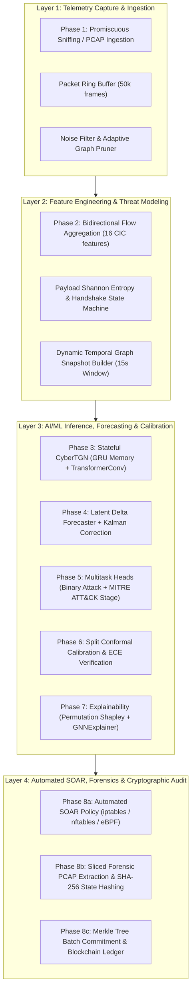
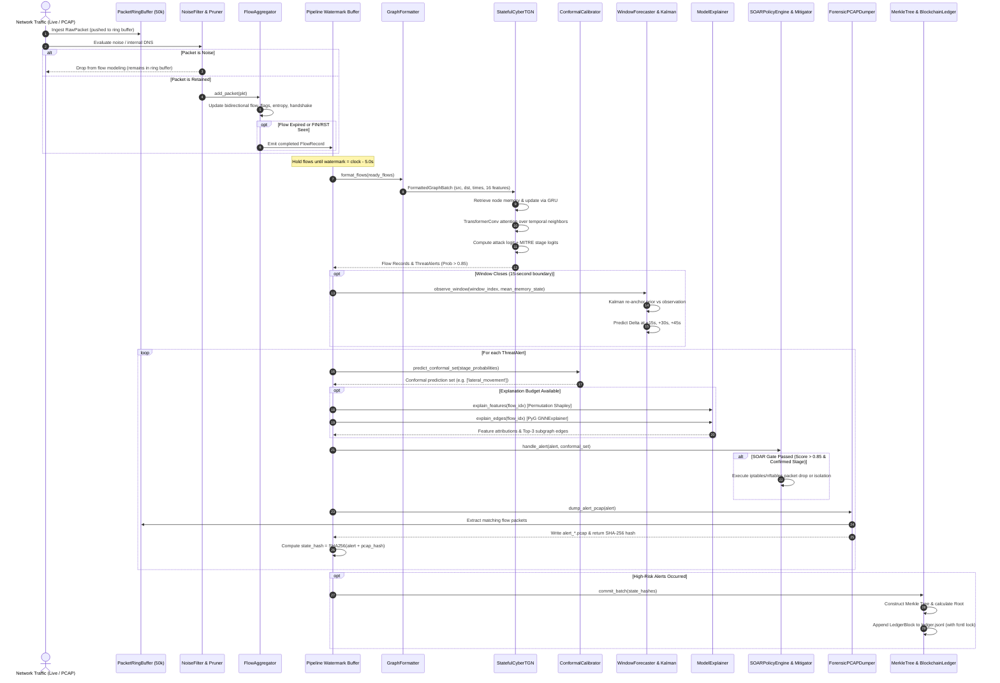
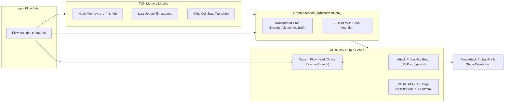

# CyberTGN: Autonomous Temporal Graph Network Intrusion Detection & Response Platform

> **Research Prototype & Architectural Blueprint**  
> **Status:** Active Research Snapshot (Reviewed September 2026)  
> **Core Architecture:** Streaming Temporal Graph Networks (TGN) + Fast-Path Microsecond Heuristics + Multi-Horizon Kalman Forecasting + Split Conformal Prediction + Permutation Shapley / GNNExplainer + Automated SOAR Mitigation + Cryptographic Merkle Blockchain Ledger.

---

## Table of Contents

1. [Executive Summary & Architectural Philosophy](#1-executive-summary--architectural-philosophy)
2. [High-Level Architectural Model (4 Layers & 8 Phases)](#2-high-level-architectural-model-4-layers--8-phases)
3. [Dual-Path System Architecture](#3-dual-path-system-architecture)
   - [Path A: Real-Time API & SOC Dashboard Stream](#path-a-real-time-api--soc-dashboard-stream)
   - [Path B: Causal Closed-Window Autonomous Pipeline](#path-b-causal-closed-window-autonomous-pipeline)
4. [Complete End-to-End Workflow & Dataflow](#4-complete-end-to-end-workflow--dataflow)
5. [In-Depth Subsystem & Component Guide](#5-in-depth-subsystem--component-guide)
   - [5.1 Layer 1: Ingestion, Ring Buffer, & Adaptive Pruning](#51-layer-1-ingestion-ring-buffer--adaptive-pruning)
   - [5.2 Layer 2: Feature Engineering & Threat Modeling](#52-layer-2-feature-engineering--threat-modeling)
   - [5.3 Layer 3: Dynamic Temporal Graph & AI/ML Inference Engine](#53-layer-3-dynamic-temporal-graph--aiml-inference-engine)
   - [5.4 Multi-Horizon Latent Forecasting & Kalman Re-Anchoring](#54-multi-horizon-latent-forecasting--kalman-re-anchoring)
   - [5.5 Split Conformal Prediction & Calibration](#55-split-conformal-prediction--calibration)
   - [5.6 Dual-Mode Model Explainability (Shapley + GNNExplainer)](#56-dual-mode-model-explainability-shapley--gnnexplainer)
   - [5.7 Layer 4: Automated SOAR & Mitigation Engine](#57-layer-4-automated-soar--mitigation-engine)
   - [5.8 Forensics, Merkle Trees, & Blockchain Ledger](#58-forensics-merkle-trees--blockchain-ledger)
6. [Case Studies & Synthetic Threat Scenarios](#6-case-studies--synthetic-threat-scenarios)
7. [Repository File & Directory Structure](#7-repository-file--directory-structure)
8. [API & SOC Operations Dashboard Reference](#8-api--soc-operations-dashboard-reference)
9. [Model Training, Datasets, & Retraining Pipeline](#9-model-training-datasets--retraining-pipeline)
10. [Empirical Evaluation, Benchmarks, & Operational Status](#10-empirical-evaluation-benchmarks--operational-status)
11. [Installation, Setup, & Verification](#11-installation-setup--verification)

---

## 1. Executive Summary & Architectural Philosophy

**CyberTGN** is an advanced network security research platform designed to combine graph representation learning with streaming network telemetry. Traditional network intrusion detection systems (NIDS) either rely strictly on stateless packet/flow tabular classifiers (which ignore network topology, pivoting, and temporal evolution) or rule-based signature inspection (which miss zero-day multi-stage attacks and living-off-the-land techniques).

CyberTGN bridges this gap by modeling computer networks as **continuous-time dynamic temporal graphs** $\mathcal{G}(t) = (\mathcal{V}(t), \mathcal{E}(t))$ where:
- **Nodes $\mathcal{V}$** represent network endpoints (IP addresses with structural and operational roles).
- **Edges $\mathcal{E}$** represent bidirectional communication flows occurring at discrete timestamps $t_i$.
- **Edge Attributes $\mathbf{e}_{uv}(t)$** represent statistical flow dynamics, protocol metrics, and payload entropy.
- **Node Memory $\mathbf{s}_v(t)$** is dynamically updated via Recurrent Neural Networks (GRU) to preserve long-term interaction history.
- **Graph Attention Transformers** aggregate neighborhood interactions to generate contextualized node and interaction embeddings.

### Core Design Principles

1. **Dual-Tier Detection (Fast Path + Deep Path):** Instant microsecond heuristic detection catches volumetric floods and port scans on packet 1, while a persistent Temporal Graph Network detects stealthy, multi-hop lateral movement and command-and-control (C2) campaigns.
2. **Causal Integrity:** Strict monotonic event ordering and closed-window watermarking prevent temporal data leakage and lookahead bias.
3. **Statistical Guarantees (Conformal Calibration):** Rather than blindly trusting uncalibrated softmax/sigmoid outputs, CyberTGN utilizes Split Conformal Prediction to output mathematically bounded prediction sets with finite-sample coverage guarantees.
4. **Predictive Forecasting:** Anticipates network latent state deltas across 15-second, 30-second, and 45-second horizons, re-anchored using Kalman filtering.
5. **Auditable Explainability:** Explains verdicts through permutation-based Shapley feature attributions and GNNExplainer historical interaction subgraphs.
6. **Immutable Cryptographic Proofs:** Threat incidents and associated forensic PCAPs are hashed with SHA-256, batched into binary Merkle Trees, and committed to an append-only cryptographic blockchain ledger.

---

## 2. High-Level Architectural Model (4 Layers & 8 Phases)

CyberTGN is organized into a cohesive 4-layer functional architecture mapping directly to an 8-phase cyber-defense processing lifecycle:



### The 8 Architectural Phases

| Phase | Phase Name | Primary Modules | Key Functionality |
|---|---|---|---|
| **Phase 1** | **Telemetry Capture & Adaptive Pruning** | `capture/`, `pruning/` | Promiscuous sniffing, 50,000-packet ring buffer, noise suppression (NTP/SSDP/MDNS), graph pruning. |
| **Phase 2** | **Dynamic Temporal Graph & Features** | `features/`, `graph/` | Bidirectional flow assembly, 16 CICFlowMeter features, Shannon entropy, TCP state tracking, IP-to-node mapping. |
| **Phase 3** | **TGN Encoding & Memory Maintenance** | `models/`, `engine/` | Continuous node memory with GRUs, signed-log time embeddings, TransformerConv graph attention. |
| **Phase 4** | **Delta Forecasting & Kalman Re-Anchoring** | `forecasting/` | 15s/30s/45s lookahead multi-horizon prediction of latent graph states, residual Kalman correction loop. |
| **Phase 5** | **Binary & MITRE Stage Classification** | `models/multitask_heads.py` | Dual multitask heads classifying attack probability and 8 MITRE ATT&CK tactical stages. |
| **Phase 6** | **Split Conformal Calibration** | `calibration/` | Distribution-free finite-sample confidence intervals ($1-\alpha$) and multi-class conformal stage prediction sets. |
| **Phase 7** | **Graph & Feature Explainability** | `explainability/` | Permutation Shapley feature importance on current flow + PyG GNNExplainer edge masking on interaction topology. |
| **Phase 8** | **Automated SOAR & Forensic Ledger** | `soar/`, `forensics/`, `ledger/` | Threshold/conformal-gated firewall mitigation, forensic PCAP slicing, Merkle tree batching, immutable blockchain ledger. |

---

## 3. Dual-Path System Architecture

The codebase implements two distinct operational paths designed for complementary operational environments:

```
+----------------------------------------------------------------------------------------------------+
|                                    CYBERTGN INGESTION SOURCES                                      |
|                                 (Live Network Interface / Offline PCAPs)                           |
+----------------------------------------------------------------------------------------------------+
                                      |                                  |
                                      v                                  v
+---------------------------------------------------+  +---------------------------------------------+
|   PATH A: REAL-TIME SERVICE & SOC DASHBOARD       |  |   PATH B: CAUSAL CLOSED-WINDOW PIPELINE     |
|   (Entry point: api.py / app.py)                  |  |   (Entry point: pipeline.py / demo.py)      |
+---------------------------------------------------+  +---------------------------------------------+
| 1. LiveTrafficSniffer / PCAP Upload Handler       |  | 1. PacketSniffer & Circular Ring Buffer     |
| 2. FlowEngine (Bidirectional flow assembly)       |  | 2. NoiseFilter & AdaptiveGraphPruner        |
| 3. FastHeuristicEngine:                           |  | 3. FlowAggregator (Entropy + Handshake)     |
|    - Port scan detection (>=12 ports in 10s)      |  | 4. Bounded Completed-Flow Reorder Buffer    |
|    - SYN Flood / UDP Flood / Slowloris / DDoS     |  | 5. 15-Second Watermark Window Closing       |
| 4. StreamingModelRuntime (CyberTGN graph inference)| | 6. GraphFormatter (Tensor batch formatting) |
| 5. Confidence Arbiter / HybridDetector:           |  | 7. StatefulCyberTGN Forward Pass:           |
|    - Sources: DUAL_CONFIRMED, HEURISTIC_INSTANT,  |  |    - Binary probability + Conformal bound   |
|      CYBERTGN_GRAPH, BENIGN                       |  |    - MITRE ATT&CK Stage classification      |
| 6. MitigationController (Active blocklist)        |  | 8. WindowForecaster (15s, 30s, 45s horizons)|
| 7. FastAPI Endpoints & WebSocket Server           |  | 9. Model Explainer (Shapley + GNNExplainer) |
| 8. Interactive SOC Operations Console             |  | 10. SOAR Policy Engine (Strict gating)      |
|    (HTML5/CSS3 Single Page Application)           |  | 11. Forensic PCAP Dumper & State Hasher     |
|                                                   |  | 12. Merkle Tree & Blockchain Ledger Block   |
+---------------------------------------------------+  +---------------------------------------------+
```

### Path A: Real-Time API & SOC Dashboard Stream
- **Target:** Production analysts, interactive operations, continuous traffic monitoring, and microsecond threat alerts.
- **Engine:** `engine.hybrid_detector.HybridDetector` + `engine.flow_engine.FlowEngine` + `model_runtime.ModelRuntime`.
- **Latency:** Microseconds on heuristic hits; sub-10ms on CyberTGN neural evaluation.
- **Output:** Live WebSocket feed broadcasting to `static/dashboard.html` with real-time KPI metrics, threat classification tags, and firewall block controls.

### Path B: Causal Closed-Window Autonomous Pipeline
- **Target:** High-assurance autonomous defense, zero lookahead bias, research experimentation, and strict forensic auditability.
- **Engine:** `pipeline.CyberDefensePipeline` orchestrating all 8 modular phases.
- **Processing Unit:** 15-second discrete completed-flow windows governed by an idle-time watermark (5-second default delay) to guarantee causal ordering.
- **Output:** `PipelineCycleResult` containing detailed `IncidentReport` objects, calibrated conformal prediction sets, future state forecasts, forensic PCAP dumps, and Merkle blockchain blocks.

---

## 4. Complete End-to-End Workflow & Dataflow

The following sequence diagram traces the complete lifecycle of network packets traversing Path B (the full autonomous defense pipeline):



---

## 5. In-Depth Subsystem & Component Guide

### 5.1 Layer 1: Ingestion, Ring Buffer, & Adaptive Pruning
*Files:* `capture/sniffer.py`, `capture/filter.py`, `pruning/graph_pruner.py`

- **`PacketRingBuffer`:** A thread-safe, circular memory buffer storing up to 50,000 raw frames (`RawPacket`). Even if a packet is deemed noise by downstream feature extractors, it is preserved in the ring buffer. When an alert fires, exact raw frames are sliced out for forensic evidence.
- **`PacketSniffer`:** Multi-threaded packet ingestion supporting:
  - Live promiscuous sniffing via Scapy `AsyncSniffer` or raw sockets.
  - Offline PCAP streaming via `PcapReader` with zero memory bloating.
- **`NoiseFilter`:** Drops high-volume protocol noise that skews graph representations without security relevance (NTP on port 123, SSDP on port 1900, mDNS on port 5353, LLMNR on port 5355, NetBIOS on ports 137–138). Configurable DNS retention (retained by default for C2 tunneling analysis).
- **`AdaptiveGraphPruner`:** Regulates graph edge density. Prunes internal broadcast noise and enforces node degree caps to prevent high-degree hubs from causing out-of-memory errors during graph attention convolutions.

### 5.2 Layer 2: Feature Engineering & Threat Modeling
*Files:* `features/flow_aggregator.py`, `features/dual_branch.py`, `features/entropy.py`, `features/handshake.py`, `features/port_roles.py`

#### The 16 Canonical CICFlowMeter Features
CyberTGN consumes the exact 16 statistical features specified below in strict order:

| Index | Feature Name | Description | Units / Scale |
|---|---|---|---|
| 0 | `Flow Duration` | Total duration of the bidirectional flow | Microseconds ($\mu s$) |
| 1 | `Total Fwd Packet` | Total packets transmitted in forward direction | Integer count |
| 2 | `Total Bwd packets` | Total packets transmitted in backward direction | Integer count |
| 3 | `Total Length of Fwd Packet` | Total payload/header bytes in forward direction | Bytes |
| 4 | `Total Length of Bwd Packet` | Total payload/header bytes in backward direction | Bytes |
| 5 | `Fwd Packet Length Mean` | Mean size of forward packets | Bytes |
| 6 | `Bwd Packet Length Mean` | Mean size of backward packets | Bytes |
| 7 | `Flow Bytes/s` | Throughput rate in bytes per second | Bytes/second |
| 8 | `Flow Packets/s` | Transmission rate in packets per second | Packets/second |
| 9 | `Flow IAT Mean` | Mean inter-arrival time between all packets | Microseconds ($\mu s$) |
| 10 | `Fwd IAT Mean` | Mean inter-arrival time between forward packets | Microseconds ($\mu s$) |
| 11 | `Bwd IAT Mean` | Mean inter-arrival time between backward packets | Microseconds ($\mu s$) |
| 12 | `Fwd Packets/s` | Forward packet rate | Packets/second |
| 13 | `Bwd Packets/s` | Backward packet rate | Packets/second |
| 14 | `Average Packet Size` | Mean size across all packets in the flow | Bytes |
| 15 | `Down/Up Ratio` | Ratio of backward packets to forward packets | Dimensionless ratio |

#### Advanced Threat Modeling Enhancements
- **Shannon Payload Entropy (`features/entropy.py`):** Calculates empirical byte entropy $H(X) = -\sum_{i=0}^{255} p(x_i) \log_2 p(x_i)$ over the initial 4KB of payload. Classifies traffic as `EMPTY` ($0$), `LOW` ($<3.0$, plaintext ASCII), `MEDIUM` ($3.0-6.8$, structured code), `HIGH` ($6.8-7.5$, compressed), or `VERY_HIGH` ($>7.5$, encrypted exploit payloads, shellcode, packed binaries).
- **TCP Handshake State Tracking (`features/handshake.py`):** Explicitly models connection state transitions (`CLOSED`, `SYN_SENT`, `SYN_RCVD`, `ESTABLISHED`, `FIN_WAIT`, `RESET`). Extracts SYN-to-ACK ratios and three-way handshake completion latency to pinpoint scan sweeps and SYN floods.
- **Port Profiling (`features/port_roles.py`):** Maps ephemeral vs registered ports to detect lateral port hopping, database probing (3306, 5432), remote admin access (22, 3389), and web shells (80, 443, 8080).
- **Dual-Branch 32-Dimensional Architecture (`features/dual_branch.py`):** Combines micro-dynamic packet metrics (16 features: TTL variance, TCP window variance, individual flag counts, flag ratios) with macro-dynamic flow metrics (16 features) to construct a comprehensive 32-dimensional edge vector $\mathbf{f}_e \in \mathbb{R}^{32}$.

### 5.3 Layer 3: Dynamic Temporal Graph & AI/ML Inference Engine
*Files:* `models/tgn.py`, `models/memory.py`, `models/multitask_heads.py`, `models/current_flow.py`, `models/time_features.py`, `graph/graph_formatter.py`, `engine/stateful_tgn.py`



- **`MemoryModule`:** Tracks persistent node state using a GRU cell:
  $$\mathbf{s}_v(t) = \text{GRU}(\mathbf{m}_v(t), \mathbf{s}_v(t^-))$$
  where raw messages $\mathbf{m}_v(t) = [\mathbf{s}_u(t^-) \,\|\, \mathbf{s}_v(t^-) \,\|\, \Delta t \,\|\, \mathbf{e}_{uv}(t)]$.
- **`GraphAttentionEmbedding`:** Utilizes PyTorch Geometric `TransformerConv` with 2 attention heads over the 10 most recent temporal neighbors retrieved via `LastNeighborLoader`.
- **`TransformedTimeEncoder`:** Encodes continuous time deltas $\Delta t$ into trigonometric representations. Provides `signed_log1p` transformation:
  $$\Delta t_{\text{norm}} = \text{sign}(\Delta t) \cdot \ln(1 + |\Delta t|)$$
  This critical numerical stabilization prevents multi-million gradient spikes when newly encountered nodes present large Unix timestamp jumps.
- **`CurrentFlowHead` (v2 Residual Branch):** Eliminates the cold-start architectural blind spot of legacy TGNs. Legacy models scored flows *before* incorporating their edge features into memory, making the first flow between new nodes blind to its own features. The v2 head directly evaluates current flow features and adds residual logits:
  $$\text{logit}_{\text{attack}} = \text{MLP}_{\text{graph}}(\mathbf{z}_u, \mathbf{z}_v) + \text{MLP}_{\text{current}}(\mathbf{x}_{\text{flow}})$$
- **`MitreStageClassifier`:** Outputs calibrated probabilities across 8 MITRE ATT&CK tactical stages:
  1. `benign` (Class 0)
  2. `reconnaissance` (Class 1)
  3. `initial_access` (Class 2)
  4. `credential_access` (Class 3)
  5. `lateral_movement` (Class 4)
  6. `command_and_control` (Class 5)
  7. `exfiltration` (Class 6)
  8. `impact` (Class 7)

### 5.4 Multi-Horizon Latent Forecasting & Kalman Re-Anchoring
*Files:* `forecasting/window_forecaster.py`, `forecasting/delta_predictor.py`, `forecasting/kalman_filter.py`

CyberTGN predicts future network graph evolution rather than merely reacting to past events:

```
+------------------+         +-----------------------+         +-----------------------+
|  Closed Window j | ------> | DeltaPredictor (MLP)  | ------> | Forecasts:            |
|  Latent State s_j|         | Predicts residual     |         |   s_{j+1} (+15s)      |
+------------------+         | state deltas \Delta s |         |   s_{j+2} (+30s)      |
         |                   +-----------------------+         |   s_{j+3} (+45s)      |
         |                                                     +-----------------------+
         |                                                                 |
         | Next window closes                                              v
         v                                                     +-----------------------+
+------------------+                                           | Prior Forecast s_{j+1}|
| Observed Window  | ----------------------------------------> | vs Actual Observation |
| State s_{j+1}    |                                           +-----------------------+
+------------------+                                                       |
         |                                                                 v
         |                                                     +-----------------------+
         +---------------------------------------------------> | StateKalmanFilter:    |
                                                               | Re-anchors & corrects |
                                                               | latent trajectory     |
                                                               +-----------------------+
```

1. **Closed-Window Aggregation:** Flow events are buffered into non-overlapping 15-second windows. When the watermark advances past window boundary $(j+1) \times 15$, the window is frozen and the mean node memory state $\bar{\mathbf{s}}_j$ is extracted.
2. **Residual Delta Prediction:** An MLP with normalized input buffers predicts future latent states:
   $$\hat{\mathbf{s}}_{j+k} = \bar{\mathbf{s}}_j + \Delta \hat{\mathbf{s}}_{k}, \quad k \in \{1, 2, 3\} \implies \{+15\text{s}, +30\text{s}, +45\text{s}\}$$
3. **Kalman State Re-Anchoring:** When window $j+1$ actually arrives, its observation is matched against the pending prior $\hat{\mathbf{s}}_{j+1}$. The `StateKalmanFilter` calculates innovation residual $\mathbf{y} = \mathbf{z} - \mathbf{H}\hat{\mathbf{x}}$, computes the optimal Kalman Gain $\mathbf{K}$, and corrects the internal state before projecting forward again. If a window gap occurs, the state is reset cleanly without inventing unobserved data.

### 5.5 Split Conformal Prediction & Calibration
*Files:* `calibration/conformal.py`, `calibration/ece.py`, `calibration/artifact.py`

Traditional deep learning classifiers output pseudo-probabilities that suffer from poor calibration under distribution shifts. CyberTGN implements **Split Conformal Prediction**:

1. **Non-Conformity Scoring:** On an independent calibration split, non-conformity scores are computed against ground truth:
   $$s_i = 1 - P(y_i \mid \mathbf{x}_i)$$
2. **Finite-Sample Quantile Calculation:** For a user-selected significance level $\alpha$ (default $\alpha = 0.05$ or $0.10$ for $95\%$ or $90\%$ coverage):
   $$\hat{q} = \text{Quantile}\left(s_1, \dots, s_n; \; \frac{\lceil(n+1)(1-\alpha)\rceil}{n}\right)$$
3. **Prediction Set Generation:** For unseen runtime flows, CyberTGN constructs a dynamic prediction set $\mathcal{C}(\mathbf{x})$:
   $$\mathcal{C}(\mathbf{x}) = \left\{ y \in \mathcal{Y} : P(y \mid \mathbf{x}) \ge 1 - \hat{q} \right\}$$
4. **Autonomous Adaptation:** If the model encounters clear, unambiguous traffic, $\mathcal{C}(\mathbf{x})$ is a tight singleton (e.g. `['benign']` or `['command_and_control']`). If traffic is novel or ambiguous, the set automatically expands (e.g. `['lateral_movement', 'command_and_control']`).
5. **Expected Calibration Error (ECE):** Evaluated over 10 confidence bins to measure empirical reliability $| \text{acc}(B_m) - \text{conf}(B_m) |$.

### 5.6 Dual-Mode Model Explainability (Shapley + GNNExplainer)
*Files:* `explainability/model_explainer.py`

Every high-risk alert can be inspected using two model-based explanation mechanisms executed on frozen pre-update states:

```
+---------------------------------------------------------------------------------------------+
|                                    FROZEN PRE-UPDATE STATE                                  |
|         (Preserves graph topology and node memories exactly as they were before the alert)   |
+---------------------------------------------------------------------------------------------+
                               |                                              |
                               v                                              v
         +-------------------------------------------+  +--------------------------------------------+
         |     PERMUTATION SHAPLEY (FEATURES)        |  |        PyG GNNEXPLAINER (TOPOLOGY)         |
         +-------------------------------------------+  +--------------------------------------------+
         | - Explains: 16 current-flow features      |  | - Explains: Historical interaction edges   |
         | - Method: Monte Carlo permutation orders  |  | - Method: Edge mask gradient optimization  |
         | - Reference: Dataset feature means        |  | - Output: Top-3 critical interaction edges |
         | - Output: Importance weight, std error,   |  |   mapped directly to source/dest IPs       |
         |   primary driver, additivity residual     |  | - Target: Maximizes logit of predicted class|
         +-------------------------------------------+  +--------------------------------------------+
```

### 5.7 Layer 4: Automated SOAR & Mitigation Engine
*Files:* `soar/mitigation.py`, `soar/policy.py`, `engine/mitigation.py`

The Security Orchestration, Automation, and Response (SOAR) engine converts detection verdicts into immediate network defenses:

- **Supported Enforcement Backends:**
  - `nftables` (Modern Linux packet filtering via `nft add rule`)
  - `iptables` (Kernel firewall drop via `iptables -I INPUT -s <IP> -j DROP`)
  - `eBPF / XDP` (High-performance programmable network interface drop hooks)
  - `simulated` (Safe dry-run default that logs complete commands without modifying network configuration)
- **Mitigation Actions:**
  - `instant_packet_drop`: Immediate firewall drop of attacker IP.
  - `isolate_host`: Complete isolation of an internal compromised victim host from all subnets except the SOC forensic server.
  - `decoy_reroute`: Transparently rewrites traffic via NAT to route attacker connections into an isolated honeypot container.
- **Strict SOAR Execution Gate:** To prevent catastrophic false-positive lockouts, automated active mitigation is gated behind four concurrent criteria:
  1. Attack probability $> 0.85$.
  2. Binary conformal test confirmed.
  3. MITRE stage conformal set is non-empty and contains **only** `lateral_movement` or `command_and_control`.
  4. The model checkpoint carries verified stage-validation evidence.

### 5.8 Forensics, Merkle Trees, & Blockchain Ledger
*Files:* `forensics/pcap_dumper.py`, `forensics/hasher.py`, `forensics/merkle_tree.py`, `ledger/blockchain_ledger.py`

```
 [Threat Alert Details]                 [Matching Packets in Ring Buffer]
           |                                            |
           v                                            v
 [Incident JSON Object]                  [Extracted alert_<id>.pcap]
           |                                            |
           +--------------------+-----------------------+
                                |
                                v
                   [SHA-256 Incident State Hash]
                     h_i = SHA256(alert || pcap_hash)
                                |
        +-----------------------+-----------------------+
        |                       |                       |
     [Leaf 1]                [Leaf 2]                [Leaf 3] ...
        \                       /
         \                     /
       [Hash 1-2]           [Hash 3-4]
            \                   /
             \                 /
              [ MERKLE ROOT ]
                     |
                     v
  +---------------------------------------+
  |           BLOCKCHAIN BLOCK            |
  |  - Block Index: #42                   |
  |  - Timestamp: 1788973067.4            |
  |  - Prev Block Hash: 8fa2c01...        |
  |  - Merkle Root: 4e9d31b...            |
  |  - Leaf Hashes: [h1, h2, ...]         |
  |  - Block Hash: SHA256(Block Header)   |
  +---------------------------------------+
                     |
                     v
         Appended to ledger.jsonl
         (Guarded by fcntl file locks)
```

1. **Forensic PCAP Slicing:** Extracts all raw frames belonging to the flagged bidirectional flow from the ring buffer and writes a forensically clean `.pcap` file to disk.
2. **State Hashing:** Computes a unique SHA-256 state hash binding the alert metadata to the exact raw packet dump:
   $$\text{StateHash} = \text{SHA256}(\text{alert\_id} \,\|\, \text{timestamp} \,\|\, \text{src} \,\|\, \text{dst} \,\|\, \text{pcap\_sha256})$$
3. **Cryptographic Merkle Tree:** Batches state hashes into a balanced binary Merkle Tree. Leaves are recursively hashed in pairs to compute an immutable Merkle Root.
4. **Append-Only Blockchain Ledger:** Commits blocks to `ledger/ledger.jsonl`. Each block stores the previous block's SHA-256 hash, forming a tamper-evident cryptographic hash chain. Cross-process concurrency is strictly guarded with advisory shared and exclusive file locks (`fcntl.flock`).
5. **Audit Verification:** The entire chain can be audited at any time via `BlockchainLedger.verify_integrity()`, ensuring no historical record or forensic proof has been modified or excised.

---

## 6. Case Studies & Synthetic Threat Scenarios

The repository includes a dedicated test engine (`casestudies/threat_scenarios.py`) providing synthetic packet fixtures inspired by four major threat profiles. These scenarios exercise the entire 8-phase pipeline:

| Scenario | Modeled Threat / Target | Modeled Attack Pattern | Pipeline Detection & Mitigation Path |
|---|---|---|---|
| **1. SUNBURST Supply Chain** | SolarWinds backdoor (CVE-2020-10148) | 2-week dormancy period, DGA DNS C2 subdomain tunneling, outbound HTTPS beaconing. | High payload entropy ($>7.2$), DNS retention, C2 stage tagging, automated decoy reroute. |
| **2. Telecom Core Breach** | Salt Typhoon Telecom APT | Core switch compromise, malware-less living-off-the-land, lateral pivot into CALEA lawful intercept (port 8443). | Internal-to-internal graph traversal, Lateral Movement stage classification, immediate host isolation. |
| **3. Router Exploit Chain** | Cisco RV320 / RV325 (CVE-2019-1653) | Unauthenticated configuration dump (`/view.cgi`) followed by diagnostic-interface command injection. | Rapid HTTP request sequence, high forward/backward packet imbalance, instant packet drop. |
| **4. Critical Infrastructure Pivot** | Volt Typhoon (KV-Botnet) | SOHO router relay proxy hopping via WMI/SMB (port 445) into internal SCADA energy asset controller. | Port role profiling (ephemeral to 445), abnormal SYN/ACK handshake ratio, firewall block. |

> [!NOTE]
> These case studies are synthetic integration test fixtures designed to verify pipeline plumbing, forensic capture, and SOAR execution. They are not validated reproductions of real-world advanced persistent threat (APT) campaigns.

---

## 7. Repository File & Directory Structure

```
.
├── README.md                           # Master architectural reference & operations manual
├── attack.md                           # Threat coverage, per-family data support, and audit gaps
├── api.py                              # Production FastAPI application & WebSocket broadcast server
├── app.py                              # Unified CLI entry point for API serving or batch JSON inference
├── demo.py                             # End-to-end 8-phase synthetic architectural demonstration
├── pipeline.py                         # Master CyberDefensePipeline orchestrator (all 8 phases)
├── model_runtime.py                    # Checkpoint loading, IP mapping, and thread-safe TGN batch scoring
├── train.py                            # CLI for dataset preparation, TGN training, and test evaluation
├── premium-ui.json                     # SOC UI design system binding configuration
│
├── capture/                            # Layer 1: Ingestion & Buffering
│   ├── __init__.py
│   ├── sniffer.py                      # PacketSniffer & thread-safe circular PacketRingBuffer
│   └── filter.py                       # NoiseFilter for protocol suppression (NTP/SSDP/mDNS)
│
├── pruning/                            # Layer 1: Graph Pruning
│   ├── __init__.py
│   └── graph_pruner.py                 # AdaptiveGraphPruner for edge and degree capacity control
│
├── features/                           # Layer 2: Feature Engineering
│   ├── __init__.py
│   ├── flow_aggregator.py              # Bidirectional flow assembler & 16 CIC feature generator
│   ├── dual_branch.py                  # 32-dim edge vector (16 micro-packet + 16 macro-flow)
│   ├── entropy.py                      # Shannon payload byte entropy computation
│   ├── handshake.py                    # TCP state machine & handshake latency tracker
│   └── port_roles.py                   # Port profiling (admin, web, db, ephemeral)
│
├── graph/                              # Layer 2 & 3: Temporal Graph
│   ├── __init__.py
│   ├── graph_formatter.py              # Dynamic IP-to-Node mapper & PyG tensor batch builder
│   └── temporal_windows.py             # 15-second temporal snapshot tensor builder
│
├── models/                             # Layer 3: Neural Network Architectures
│   ├── __init__.py
│   ├── tgn.py                          # CyberTGN & TransformerConv GraphAttentionEmbedding
│   ├── memory.py                       # MemoryModule with TGNMemory GRU & LastAggregator
│   ├── multitask_heads.py              # AttackProbabilityHead & MitreStageClassifier MLPs
│   ├── current_flow.py                 # v2 CurrentFlowHead for residual current-feature scoring
│   └── time_features.py                # TransformedTimeEncoder (signed_log1p & identity)
│
├── engine/                             # Detection & Runtime Engines
│   ├── __init__.py
│   ├── stateful_tgn.py                 # StatefulCyberTGN persistent streaming engine
│   ├── hybrid_detector.py              # Dual HybridDetector (FastHeuristicEngine + TGN Runtime)
│   ├── flow_engine.py                  # Standalone PCAP & live packet bidirectional flow tracker
│   ├── streaming_runtime.py            # StreamingModelRuntime wrapper for live flow batches
│   ├── live_sniffer.py                 # Background thread runner linking sniffer to hybrid detector
│   ├── mitigation.py                   # MitigationController for runtime IP blocking
│   └── conformal.py                    # Base split conformal predictor
│
├── forecasting/                        # Layer 3: Predictive Forecasting
│   ├── __init__.py
│   ├── delta_predictor.py              # Multi-head MLP forecasting 15s/30s/45s latent deltas
│   ├── kalman_filter.py                # StateKalmanFilter for latent state correction
│   └── window_forecaster.py            # WindowForecaster managing 15-second closed-window loop
│
├── calibration/                        # Layer 3: Statistical Calibration
│   ├── __init__.py
│   ├── conformal.py                    # MultiClassSplitConformal prediction set builder
│   ├── ece.py                          # Expected Calibration Error (ECE) & reliability diagrams
│   └── artifact.py                     # Secure calibration file (.npz) serialization & verification
│
├── explainability/                     # Layer 3: Model Explainability
│   ├── __init__.py
│   └── model_explainer.py              # Permutation Shapley & PyG GNNExplainer on frozen states
│
├── soar/                               # Layer 4: Automated Response
│   ├── __init__.py
│   ├── mitigation.py                   # FirewallMitigator (nftables, iptables, eBPF, dry-run)
│   └── policy.py                       # SOARPolicyEngine with multi-factor mitigation gating
│
├── forensics/                          # Layer 4: Forensic Artifacts
│   ├── __init__.py
│   ├── pcap_dumper.py                  # ForensicPCAPDumper for extracting incident PCAPs
│   ├── hasher.py                       # Incident state hasher (alert + PCAP SHA-256)
│   └── merkle_tree.py                  # Cryptographic binary Merkle Tree builder
│
├── ledger/                             # Layer 4: Cryptographic Audit
│   ├── __init__.py
│   ├── blockchain_ledger.py            # BlockchainLedger appending Merkle blocks to JSONL
│   └── ledger.jsonl                    # Local append-only cryptographic blockchain ledger
│
├── casestudies/                        # Scenario Test Fixtures
│   ├── __init__.py
│   └── threat_scenarios.py             # Synthetic generator for SUNBURST, Salt/Volt Typhoon, Cisco
│
├── training/                           # Model Training & Pipeline Verification
│   ├── __init__.py
│   ├── runner.py                       # TGN training loops, early stopping, & checkpointing
│   ├── data.py                         # Chronological shard importer, SQLite sorter, deduplication
│   ├── tabular.py                      # Feature-only MLP and logistic regression trainers
│   ├── forecast.py                     # Multi-horizon latent delta forecast trainer
│   ├── export_forecast.py              # Closed-window latent state exporter from PCAPs
│   ├── losses.py                       # Weighted BCE & masked stage cross-entropy objectives
│   ├── assessment.py                   # Classification metrics, confusion matrices, Wilson intervals
│   └── smoke.py                        # Minimal synthetic dataset generator for fast smoke tests
│
├── scripts/                            # Operational & Diagnostic Utilities
│   ├── audit_feature_consistency.py    # Audits datasets for identical features with conflicting labels
│   ├── diagnose_graph_gradients.py     # Probes gradient norms under time encoding transforms
│   ├── prepare_cic2017.py              # Manifest preparation helper for CIC-IDS2017
│   ├── run_controlled_baselines.py     # Controlled baseline comparisons across data configurations
│   ├── run_isolated.py                 # Subprocess execution isolation helper
│   ├── verify_evidence.py              # Cryptographic verification of forensic evidence and ledger
│   └── verify_live.py                  # Live network interface capture validation check
│
├── checkpoints/                        # Model Weights
│   └── tgn_best.pt                     # Retained historical CyberTGN checkpoint
│
├── static/                             # Web Frontend
│   └── dashboard.html                  # Interactive SOC Operations Console (HTML5/CSS3/Vanilla JS)
│
├── docs/                               # Detailed Technical Guides
│   ├── training.md                     # Complete retraining, losses, metrics, and forecast manual
│   ├── datasets.md                     # Dataset choices, schema rules, and provenance guidelines
│   ├── design.md                       # UI design tokens, component rules, and color palette
│   └── model-history.md                # Historical evaluation reports of retained checkpoints
│
├── reports/audit/                      # Audit Logs & Verification Evidence
│   ├── controlled-baselines.json       # Machine-readable benchmarks for feature models
│   ├── controlled-baselines.log        # Raw execution logs for controlled baseline runs
│   ├── integration-verification.json   # Machine-readable integration check outputs
│   ├── training-remediation.md         # Comprehensive audit and remediation findings
│   └── code-cleanup-tests.log          # 96-test unit test verification log
│
└── tests/                              # Complete Unit & Regression Test Suite (96 Tests)
    ├── test_complete_system.py
    ├── test_end_to_end_pipeline.py
    ├── test_advanced_phases_and_scenarios.py
    ├── test_model_integration.py
    ├── test_model_service.py
    ├── test_operational_verification.py
    ├── test_regressions.py
    ├── test_tabular_baseline.py
    ├── test_training.py
    ├── test_training_objectives.py
    ├── test_training_stability.py
    └── test_cic2017_conversion.py
```

---

## 8. API & SOC Operations Dashboard Reference

The FastAPI application (`api.py`) exposes both synchronous REST endpoints and an asynchronous WebSocket stream for SOC monitoring.

### REST Endpoints

| Method | Route | Purpose | Key Parameters / Payload |
|---|---|---|---|
| `GET` | `/health` | Healthcheck and model SHA-256 verification | Returns status and checkpoint SHA-256 hash |
| `GET` | `/model` | Inspect active model schema, classes, & limits | Returns feature order, transform, timestamp format, classes |
| `POST` | `/predict` | Single flow inference (cold-start) | Single `FlowRequest` JSON object |
| `POST` | `/predict/sequence`| Batch flow inference with persistent state | `SequenceRequest` (1 to 1000 flows, batch size, threshold) |
| `GET` | `/dashboard` | Interactive SOC Operations Web Console | Serves `static/dashboard.html` |
| `POST` | `/analyze/pcap` | Upload and analyze an offline PCAP file | Multipart form upload (`.pcap`, `.pcapng`, max 64 MiB) |
| `POST` | `/sniff/start` | Start live background promiscuous sniffing | `SniffStartRequest` (interface, BPF filter) |
| `POST` | `/sniff/stop` | Stop live background sniffing | Returns termination status |
| `GET` | `/sniff/status` | Telemetry of active sniffer | Packet counters, runtime, buffer drops, active interface |
| `GET` | `/alerts` | Retrieve active firewall blocks and incidents | `limit` query parameter (default 50) |
| `POST` | `/mitigation/unblock` | Remove an IP from the active firewall blocklist | `UnblockRequest` (`{"ip": "192.168.1.100"}`) |
| `POST` | `/model/reset` | Clear graph memory and heuristic state | Resets node memory, neighbor graph, and heuristics |
| `WS` | `/ws/traffic` | Real-time WebSocket event stream | Real-time broadcast of all scored flow alerts |

### Flow Request & Prediction Schema

```json
// POST /predict/sequence
{
  "flows": [
    {
      "src_ip": "192.168.1.100",
      "dst_ip": "192.168.1.10",
      "timestamp": 1788972853.0,
      "features": [
        1250000.0, 10.0, 8.0, 1500.0, 1200.0, 150.0,
        150.0, 2160.0, 14.4, 73529.4, 138888.8, 178571.4,
        8.0, 6.4, 150.0, 0.8
      ]
    }
  ],
  "feature_format": "raw",
  "batch_size": 200,
  "threshold": 0.5
}
```

```json
// Response from /predict/sequence
[
  {
    "index": 0,
    "attack_probability": 0.9842,
    "is_attack": true,
    "mitre_stage": 4,
    "stage_name": "lateral_movement",
    "stage_probabilities": [0.001, 0.005, 0.002, 0.008, 0.965, 0.012, 0.004, 0.003],
    "cold_start": false
  }
]
```

### Interactive SOC Operations Console
Access at `http://127.0.0.1:8000/dashboard`.
- **Top KPI Cards:** Total Flows Processed, High-Risk Infiltration Alerts, Active Blocked Threat Hosts, and Sniffer Status.
- **Live Threat Stream Table:** Real-time table displaying timestamp, source/destination endpoints, protocol, detection source (`DUAL_CONFIRMED`, `CYBERTGN_GRAPH`, `HEURISTIC_INSTANT`, `BENIGN`), MITRE ATT&CK stage, risk meter bar, and detailed explanation.
- **PCAP Drag-and-Drop Dropzone:** Instantly upload and analyze `.pcap` or `.pcapng` packet captures.
- **Active Firewall Blocklist:** Inspect currently blocked IPs with an instant **Unblock** control.
- **Memory Reset Modal:** Secure HTML dialog confirming graph memory resets.

---

## 9. Model Training, Datasets, & Retraining Pipeline

CyberTGN includes a full end-to-end retraining and evaluation suite (`train.py`) that strictly avoids data leakage.

```
+---------------------------------------------------------------------------------------+
| 1. DATA PREPARATION (train.py prepare)                                                |
|    - Ingests canonical CSV files defined in manifest.json                             |
|    - SQLite disk-backed sorting by capture group and ascending timestamp             |
|    - Cross-split duplicate detection and removal                                      |
|    - Normalization parameters computed strictly on training split                     |
|    - Emits NumPy storage shards (X, y_binary, y_stage, times, src, dst)               |
+---------------------------------------------------------------------------------------+
                                           |
                                           v
+---------------------------------------------------------------------------------------+
| 2. CANDIDATE TRAINING (train.py train)                                                |
|    - Multi-task objective: Weighted BCE + Masked Stage Cross-Entropy                  |
|    - Time transformation: signed_log1p to eliminate gradient explosion               |
|    - Bounded history updates across batch sizes (1, 32, 200)                          |
|    - Validation-based early stopping with empirical target checking                   |
|    - Emits best.pt, operating-point.json, and calibration.npz                         |
+---------------------------------------------------------------------------------------+
                                           |
                                           v
+---------------------------------------------------------------------------------------+
| 3. TOUCHLESS EVALUATION (train.py evaluate)                                           |
|    - Evaluates ONLY untouched test split using frozen validation threshold            |
|    - Reports: PR-AUC, ROC-AUC, Precision, Recall, FPR, Brier score, Wilson intervals  |
|    - Checks hard gate: Precision >= 95%, Recall >= 95%, FPR <= 0.1%                   |
+---------------------------------------------------------------------------------------+
```

### Supported Datasets & Manifest Specification
- **CIC-IDS2017 & CSE-CIC-IDS2018:** Recommended starting points (with IP addresses preserved).
- **UNSW-NB15 & ToN-IoT:** Multi-modal IoT and modern enterprise evaluation captures.
- **Manifest Configuration (`examples/training/manifest.json`):**
  ```json
  {
    "sources": [
      {
        "group": "capture-2017-07-05",
        "split": "train",
        "path": "captures/wednesday.csv",
        "timestamp_format": "%d/%m/%Y %H:%M:%S",
        "timezone": "UTC",
        "timestamp_kind": "start",
        "columns": {
          "src_ip": "Source IP",
          "dst_ip": "Destination IP",
          "label": "Label"
        }
      }
    ],
    "labels": {
      "BENIGN": {"attack": 0, "stage": 0},
      "DoS Hulk": {"attack": 1, "stage": 7},
      "PortScan": {"attack": 1, "stage": 1}
    }
  }
  ```

### Training Commands

```bash
# 1. Prepare labeled datasets into chronological shards
venv/bin/python train.py prepare \
  --manifest examples/training/manifest.json \
  --output data/prepared \
  --shard-size 100000

# 2. Train a candidate CyberTGN model
venv/bin/python train.py train \
  --data data/prepared \
  --output training-runs/candidate-01 \
  --epochs 30 \
  --patience 5 \
  --device cpu \
  --time-transform signed_log1p \
  --batch-sizes 1,32,200 \
  --eval-batch-size 32 \
  --min-precision 0.95 \
  --min-recall 0.95 \
  --max-fpr 0.001 \
  --alpha 0.05

# 3. Evaluate candidate on untouched test splits
venv/bin/python train.py evaluate \
  --data data/prepared \
  --checkpoint training-runs/candidate-01/best.pt \
  --operating-point training-runs/candidate-01/operating-point.json \
  --output training-runs/candidate-01/test-report.json \
  --require-targets
```

---

## 10. Empirical Evaluation, Benchmarks, & Operational Status

### Controlled Baseline Evaluation (September 2026 Audit)
To evaluate tabular feature discrimination power independently of graph topology, controlled baselines were executed across three dataset configurations using identical 64-unit MLPs (Seed 42, AdamW, Learning Rate 0.0003, Batch Size 1024):

| Training Configuration | Average Precision (PR-AUC) | Precision @ 0.5 | Recall @ 0.5 | F1 Score @ 0.5 | False Positive Rate @ 0.5 |
|---|---:|---:|---:|---:|---:|
| **CIC2017 Only** | 0.0546 | 9.91% | 0.46% | 0.0088 | 0.238% |
| **CIC2017 + IDS2018** | 0.1019 | 9.03% | 26.82% | 0.1351 | 15.319% |
| **Combined + Family Weighting** | 0.1036 | 11.01% | 35.63% | 0.1683 | 16.315% |

> [!WARNING]
> **No tested feature candidate met the target operating point** of $\text{Precision} \ge 95\%$, $\text{Recall} \ge 95\%$, and $\text{FPR} \le 0.1\%$. An audit of 11,618 sampled vectors found 182 distinct feature vectors with contradictory labels (identical flow statistics labeled benign in one capture and attack in another). Machine learning scores must always be corroborated by conformal calibration and heuristic evidence.

### Current 8-Phase Verification Status

| Phase | Description | Implementation Status | Current Gaps Against Production |
|---|---|---|---|
| **Phase 1** | Ingestion & Pruning | Functional | No in-kernel eBPF ring buffer; pruning uses fixed thresholds. |
| **Phase 2** | Graph & Features | Functional | 16 features integrated; 32-dim dual-branch vector built but needs retraining. |
| **Phase 3** | Stateful CyberTGN | Functional | `tgn_best.pt` operates as history-dependent; v2 current-flow branch implemented. |
| **Phase 4** | Forecasting & Kalman | Functional | Window forecaster and Kalman loop complete; awaiting large-scale capture training. |
| **Phase 5** | MITRE Stage Heads | Prototype | Stage heads exist; dataset family labels do not establish verified MITRE stages. |
| **Phase 6** | Conformal Calibration| Functional | Split conformal sets and ECE implemented; requires deployment calibration set. |
| **Phase 7** | Explainability | Functional | Permutation Shapley & GNNExplainer implemented; pending dashboard visualizer. |
| **Phase 8** | SOAR & Merkle Ledger | Functional | Full firewall hooks, forensic PCAP slicing, Merkle tree & blockchain ledger working. |

---

## 11. Installation, Setup, & Verification

### Prerequisites
- **Operating System:** Linux (Ubuntu 22.04 / Debian 12 / RHEL 9 recommended)
- **Python:** Version 3.12+
- **Privileges:** Root / `sudo` privileges are required for live promiscuous sniffing (`AF_PACKET`) and active firewall enforcement (`iptables` / `nftables`).

### Step 1: Clone & Virtual Environment Setup

```bash
git clone https://github.com/prateek-boop/Cominers.git cybertgn
cd cybertgn

python3 -m venv venv
source venv/bin/activate
```

### Step 2: Install Dependencies

```bash
# Core inference, API, and SOC dashboard:
pip install -r requirements-inference.txt

# For training and data preparation:
pip install -r requirements-training.txt

# For tabular baselines:
pip install -r requirements-tabular.txt

# For running the full test suite:
pip install -r requirements-test.txt
```

### Step 3: Run the Test Suite
Verify that all 96 unit, regression, and mathematical test cases pass cleanly:

```bash
venv/bin/python -m unittest discover -s tests -v
```

### Step 4: Launch the Full Architectural Demo
Run the 8-phase synthetic attack scenario to observe end-to-end detection, mitigation, and blockchain ledger commitment:

```bash
venv/bin/python demo.py
```

### Step 5: Start the API Service & SOC Dashboard

```bash
venv/bin/python api.py --host 127.0.0.1 --port 8000
```
Open your browser at:
- **Interactive SOC Dashboard:** `http://127.0.0.1:8000/dashboard`
- **Interactive OpenAPI Documentation:** `http://127.0.0.1:8000/docs`

### Step 6: Command-Line JSON Batch Inference

```bash
# Execute batch inference against a JSON file of flows
venv/bin/python app.py --input examples/flows.json --output /tmp/predictions.json
```

---

## Technical Citations & References

- Rossi, E., et al. (2020). *Temporal Graph Networks for Deep Learning on Dynamic Graphs.* arXiv:2006.10637.
- Vovk, V., Gammerman, A., & Shafer, G. (2005). *Algorithmic Learning in a Random World.* Springer.
- Ying, R., et al. (2019). *GNNExplainer: Generating Explanations for Graph Neural Networks.* NeurIPS 2019.
- Shrikumar, A., Greenside, P., & Kundaje, A. (2017). *Learning Important Features Through Propagating Activation Differences.* ICML 2017.
- Merkle, R. C. (1987). *A Digital Signature Based on a Conventional Encryption Function.* CRYPTO '87.
- Sharafaldin, I., et al. (2018). *Toward Generating a New Intrusion Detection Dataset and Intrusion Traffic Characterization (CIC-IDS2017).* ICISSP.
